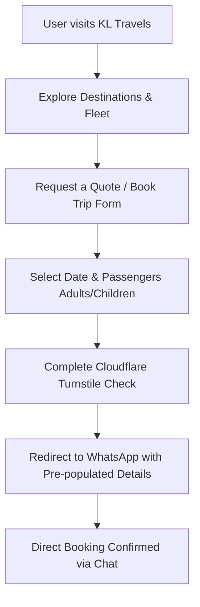

# KL Travels - Cab Booking Web Application

Welcome to the official repository of **KL Travels**, a premium, secure, and production-ready cab booking platform specialized in spiritual tours, coastal getaways, city sightseeing, and airport transfers departing from Hyderabad, India.

---

## 🚗 About the Website

**KL Travels** is designed to provide families, pilgrims, and tour groups with a smooth, interactive experience to browse destinations, select vehicles, and request quotes. The site utilizes a dark, modern aesthetic with rich typography, clean cards, and responsive layouts suitable for both mobile and desktop viewports.

### Core Features
* **Detailed Destination Guides**: Features dedicated routing pages for 10 major destinations (Srisailam, Tirupati, Pondicherry, Goa, Hyderabad Sightseeing, Yadagirigutta, Arunachalam, Shirdi, Varanasi, and Gokarna), detailing itineraries, highlights, and packages.
* **Modern Seating Counters**: Integrates numerical `+/-` selectors for Adults and Children to capture passenger details precisely.
* **Direct Call Bookings**: Features direct action buttons ("Call Now" and "Book Ride" on the fleet cards) that immediately initiate phone calls.
* **Chronological Customer Reviews**: Allows passengers to write and submit reviews. Reviews are dynamically sorted in descending chronological order (newest first).
* **Production-Grade Security**:
  * **Input Sanitization**: Automatically strips HTML elements and escapes characters to prevent Cross-Site Scripting (XSS) and HTML/SQL injection.
  * **Spam Protection**: Utilizes Cloudflare Turnstile bot checks to secure form submissions.
  * **Rate Limiting**: Enforces a 60-second local submission cooldown per client to prevent spamming.

---

## 🛠️ How It Works



### 1. Booking & Quotes Flow
* Users select their desired destination and travel date (enforced to be today or a future date).
* Users select the passenger count (separately for Adults and Children) using numeric controls, and add optional notes.
* Upon passing the Turnstile widget and rate limit checks, clicking "Get Quote" triggers a secure redirect to **WhatsApp (+91 99085 90094)**, delivering a pre-formatted, sanitized travel itinerary text.

### 2. Fleet Booking
* Inside the fleet overview, users can review specifications (Sedan, SUV, Hatchback, Tempo Traveller, Mini Bus).
* Clicking "Book Ride" initiates a direct telephone link (`tel:+919908590094`) to get in touch with the driver/operator immediately.

### 3. Chronological reviews
* The reviews tab fetches reviews from a local array, dynamically sorting them using the `parseReviewDate` helper.
* Submitting a review adds the entry to the client-side state dynamically, keeping reviews up to date chronologically.

---

## 💻 Local Development

This project is built using:
* **Vite** (Build Tool)
* **React** (UI Framework)
* **TypeScript** (Static Typing)
* **Tailwind CSS & Shadcn UI** (Styling & Component System)
* **Lucide React** (Icons)

### Setup Instructions

1. **Install Dependencies**:
   ```sh
   npm install
   ```

2. **Run Development Server**:
   ```sh
   npm run dev
   ```
   Open `http://localhost:8080` in your browser.

3. **Verify Types**:
   ```sh
   npx tsc --noEmit
   ```

4. **Production Build**:
   ```sh
   npm run build
   ```
